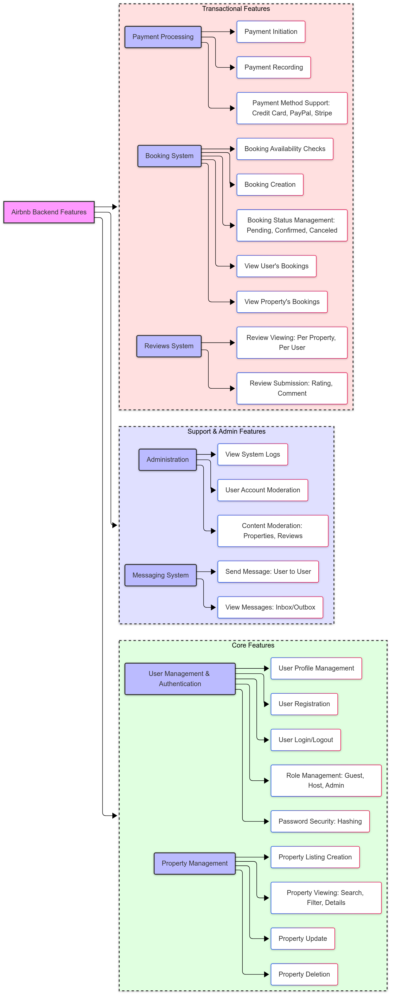

# 📦 Airbnb Clone Backend: Features and Functionalities

This directory contains documentation outlining the **core features and functionalities** that the backend system for the Airbnb Clone project is designed to support. This visual representation serves as a high-level overview of the system's capabilities.

---

## 🗂️ Backend Features Overview

Below is a visual diagram summarizing the backend features categorized by modules and user roles:

>   

---

## 🔍 Detailed Feature Breakdown

### 1. 👤 User Management & Authentication
- **User Registration**: Allow new users to create accounts.
- **User Login/Logout**: Secure authentication for existing users.
- **User Profile Management**: View and update personal details (name, email, phone).
- **Role Management**: Define user roles as `guest`, `host`, or `admin`.
- **Password Hashing**: Securely store hashed passwords.

---

### 2. 🏠 Property Management
- **Property Listing Creation**: Hosts can add properties with detailed information.
- **Property Viewing**: Guests can browse, search, and filter available properties.
- **Property Update**: Hosts can update listing information.
- **Property Deletion**: Hosts can remove properties they own.

---

### 3. 📅 Booking System
- **Booking Creation**: Guests can book properties for specific date ranges.
- **Booking Status Management**: Support booking states (`pending`, `confirmed`, `canceled`).
- **Availability Check**: Prevent overlapping bookings.
- **User Bookings View**: Guests can view their past and upcoming bookings.
- **Host Bookings View**: Hosts can see bookings for their properties.

---

### 4. 💳 Payment Processing
- **Payment Initiation**: Trigger payment upon booking confirmation.
- **Payment Recording**: Store amount, date, and method used.
- **Payment Methods**: Support for credit card, PayPal, Stripe, etc.

---

### 5. ⭐ Reviews System
- **Submit Review**: Guests can leave ratings and comments for properties they’ve booked.
- **View Reviews**: Read feedback associated with a property.
- **User Review History**: View all reviews written by a specific user.

---

### 6. 💬 Messaging System
- **Send Messages**: Users can send messages to each other (guest ↔ host).
- **View Messages**: Access inbox and sent messages.

---

### 7. 🔧 Administration (Admin Role Only)
- **User Account Moderation**: Suspend users, change roles.
- **Content Moderation**: Review and manage listings and comments.
- **System Logs**: View system activity and audit logs.

---
