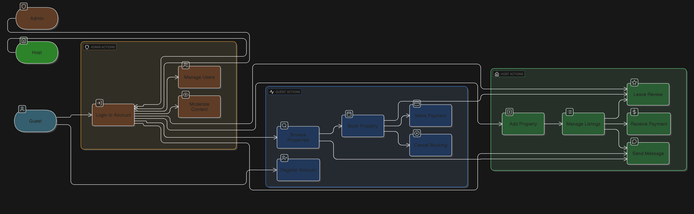

# 🧩 Use Case Diagram

This directory contains the **Use Case Diagram** for the **Airbnb Clone backend system**. The diagram visually represents the interactions between different types of users (_actors_) and the system’s key functionalities.

---

## 🎯 Purpose of the Use Case Diagram

The use case diagram serves the following purposes:

- **Identify Actors**: Clearly define the external entities that interact with the system (`Guest`, `Host`, `Admin`).
- **Define Use Cases**: Outline the main functionalities or services the system provides.
- **Visualize Interactions**: Show which actors are associated with each functionality.
- **Understand System Scope**: Define the boundaries and interactions of the system from a user-centric view.

---

## 🗂️ Diagram Overview

> 

The diagram covers interactions such as user registration, booking accommodations, handling payments, writing reviews, messaging, and administrative management.

---

## 👥 Actors and Their Primary Use Cases

### 🧑‍💼 Guest
- Register Account, Log In, Log Out
- Manage Profile
- Search Properties, View Property Details
- Book Property, View My Bookings
- Make Payment
- Write Review
- Send Message, View Messages

### 🏠 Host
- Log In, Log Out
- Manage Profile
- List Property, Update Property, Delete Property
- Search & View Properties
- Manage Property Bookings (Confirm / Cancel)
- View Reviews
- Send Message, View Messages

### 🔧 Admin
- Log In, Log Out
- Manage Users
- Moderate Content
- View System Logs

---

## 🔁 Use Case Relationships

- **Includes**:  
  Indicates a use case that is always part of another.  
  Example:  
  - `"Book Property"` _includes_ `"Check Availability"`  
  - `"Book Property"` _includes_ `"Make Payment"`

- **Extends**:  
  Indicates optional or conditional behavior that extends a base use case.  
  Example:  
  - `"Manage Property Bookings"` _can be extended by_ `"Confirm Booking"` or `"Cancel Booking"`
